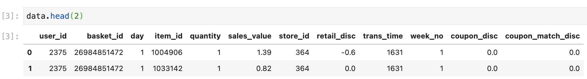
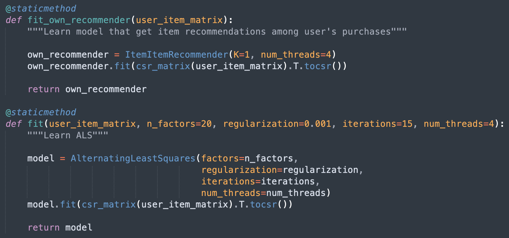
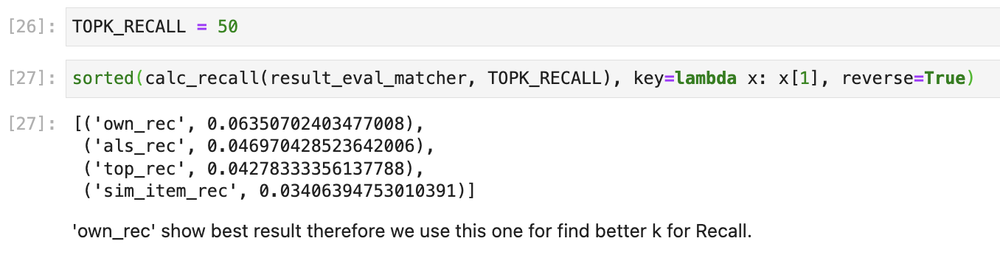
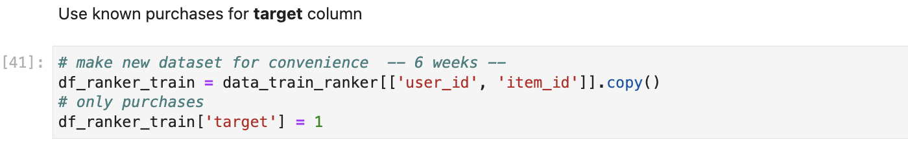
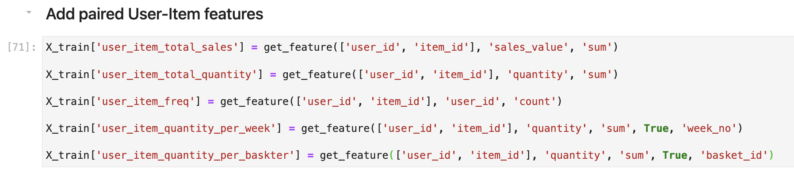
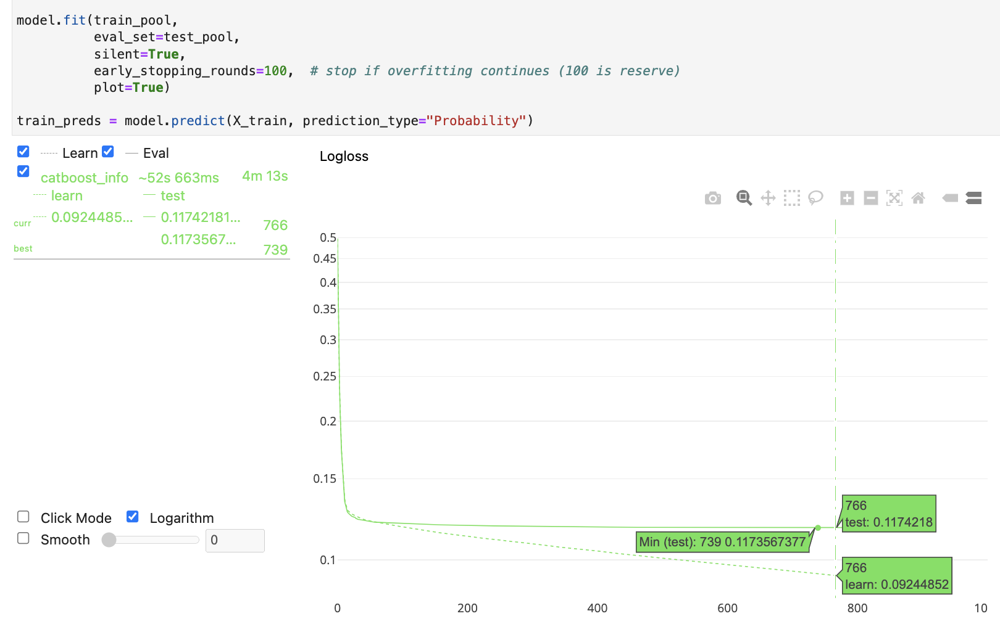
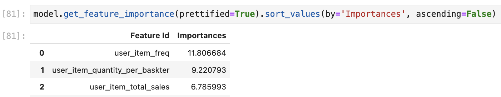

## Two-layer Hybrid Recommender System in retail

### Contents

**Stack:**

- 1-st layer: NLP, Implicit, ItemItemRecommender, ALS, sklearn, pandas, numpy, matplotlib
- 2-nd layer: CatBoost, LightGBM

**Data:** from [Retail X5 Hero Competition](https://retailhero.ai/c/recommender_system/overview)

**Task:** 
Create two-layer hybrid recommender system for retail data and evaluate it by custom **Precision@k**.

**Steps**:

1. Prepare data:  prefiltering
2. Matching model (initialize MainRecommender 1-st layer model as baseline)
3. Evaluate Top@k Recall
4. Ranking model (choose 2-nd layer model)
5. Feature engineering for ranking

### User guide

Please, open [train.ipynb](https://github.com/hildar/RecSys-Retail/blob/main/train.ipynb) Jupiter notebook file and explore how to create *Recommender system* step-by-step.

Project has next few steps:

#### 1. Prepare data

First is looking at datasets and prefiltering data

#### 2. Matching model

Learn first-layer model as baseline. In `MainRecommender` class we have two base models from implicit lib - `ItemItemRecommender` and `AlternatingLeastSquares`:

`ALS` used to find similar users, items and als recommendations. `ItemItemRecommender` used to find own item recommendations among user's purchases.

#### 3. Evaluate Top@k Recall

For first-layer model we have taken **Recall@k** metric because it is show the proportion of correct answers from real purchases. With this approach we going to significantly cut dataset size for second-layer model.

Here we are evaluating different types of recommendations:

And are selecting optimal value of Recall:

#### 4. Ranking model

In that step we are making new **X_train** dataset with **target** based on purchases:

Here we are choosing classifier from `LightGBM` and `CatBoost`, evaluate it by **Precision@k** at test data. In this step we have not impressive result.

#### 5. Feature engineering for ranking

Adding new features for ranking model based on user, item and paired user-item data.

Controling overfitting for `CatBoost` and cutting extra estimators:

Ranking model show us **doubling growth** precision metric relatively baseline. 

As we see the best feature importance is paired user-item features:

